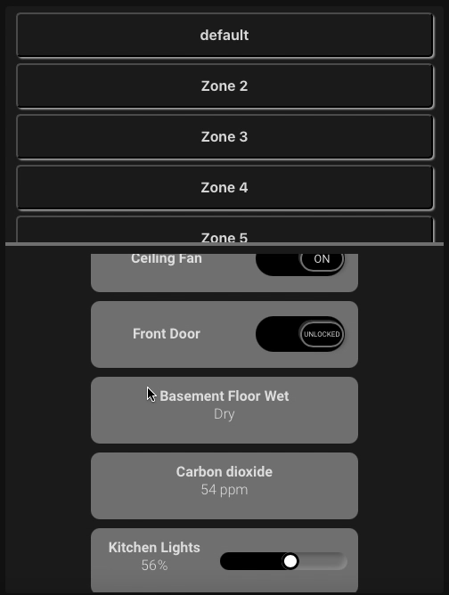

# Panel Card by [@W1ll1am12](https://www.github.com/w1ll1am12)

A home assistant card to display multiple entities for multiple zones



## Support

Hey dude! Help me out for a couple of :coffee:!

[](https://www.buymeacoffee.com/W1ll1am12)

## Options

| Name  | Type   | Requirement  | Description                               | Default             |
| ----- | ------ | ------------ | ----------------------------------------- | ------------------- |
| type  | string | **Required** | `custom:panel-card`                       |                     |
| zones | object | **Optional** | Where each set of entities will be stored | See [Zones](#Zones) |
| props | object | **Optional** | Includes size and color properties        | See [Props](#Props) |

## Zones

| Name     | Type   | Requirement  | Description                                          | Default                   |
| -------- | ------ | ------------ | ---------------------------------------------------- | ------------------------- |
| name     | string | **Required** | name of the zone                                     | `default`                 |
| entities | object | **Required** | includes all the entities to be included in the zone | See [Entities](#Entities) |

## Entities

| Name   | Type   | Requirement  | Description              | Defualts |
| ------ | ------ | ------------ | ------------------------ | -------- |
| entity | string | **Optional** | Home Assistant Entity ID | 'none'   |

Currently the only entity types that are supported are binary sensors, fans, lights, locks, switches, and sensors
More entity support is in the works

## Props

| Name | Type             | Requirement  | Description               | Supported options |
| ---- | ---------------- | ------------ | ------------------------- | ----------------- |
| name | string           | **Optional** | Name of the property      | 'any'             |
| type | string           | **Optional** | Type of the property      | 'number'/         | 'color' |
| attr | number or string | **Optional** | Attribute of the property | 'any'             |

## Usage

```yaml
resources:
  - url: /community_plugin/panel-card/panelCard.js
    type: module
```

## Basic Setup

```yaml
type: 'custom:panel-card'
zones:
  - name: default
    entities:
      - entity: light.bed_light
      - entity: light.ceiling_lights
      - entity: light.kitchen_lights
props:
  propArray:
    - name: Switch Height
      type: number
      attr: 75
    - name: Switch Width
      type: number
      attr: 300
    - name: Slider Background Color
      type: color
      attr: '#4d4d4d'
    - name: Slider Foreground Color
      type: color
      attr: '#000000'
```
